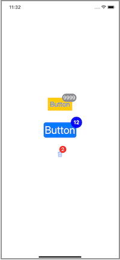

# BadgeButton

Standard UIButton with a badge

## Requirements
- iOS 9.0+

## Installation

### Swift Package Manager

Once you have your Swift package set up, adding the library as a dependency is as easy as adding it to the dependencies value of your Package.swift.

dependencies: [
    .package(url: "https://github.com/saddamakhtar88/BadgeButton.git", .upToNextMajor(from: "1.1.0"))
]

## Public APIs

### Properties

- badgeText: String?
- badgeTextColor: UIColor
- badgeColor: UIColor?
- badgeLabel: UILabel
- badgeTextVerticalPadding: CGFloat = 4.0
- badgeTextHorizontalPadding: CGFloat = 4.0
